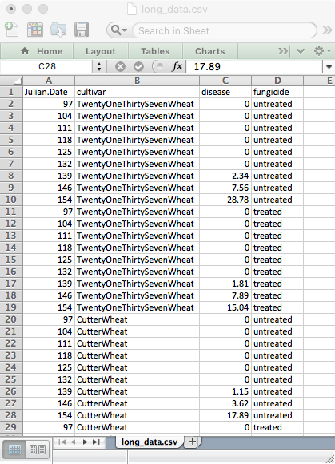
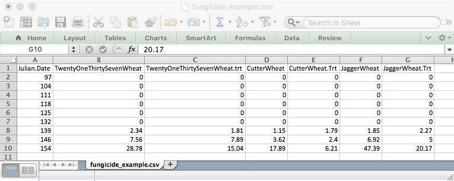
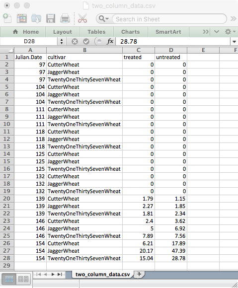
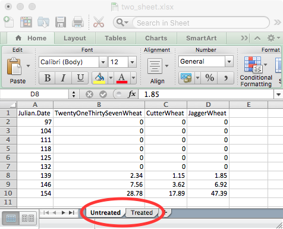
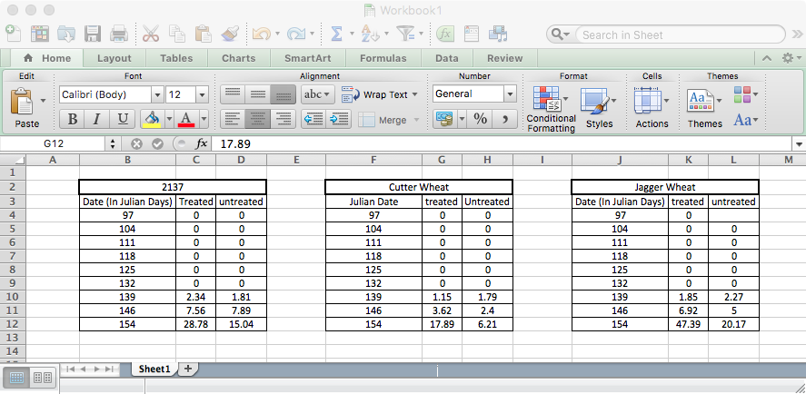

```{r init, echo=FALSE}
library(knitr)
library(xtable)
library(tools)
library(knitcitations)
opts_chunk$set(fig.width = 10,
               fig.height = 5,
               cache = FALSE)
cite_options(citation_format = "pandoc", max.names = 3, style = "html", 
             hyperlink = "to.doc")
source("functions.R")
gloss <- make_glossary_function()
ftf_def <- paste(
  "a text file to hold data in a tabular format, where cells are separated by a",
  "common character such as comma or tab. Common formats are csv and tsv."
)
```

# Data Formatting

GIGO is an acronym that stands for "Garbage In, Garbage Out", and this is often 
a mantra to remember when gathering data. The same goes for entering and storing
data in a spreadsheet. Often, the first point of error for any analysis is at 
the data entry stage. This section will show you the best practices of data 
storage and why this is important for your analyses, whether you are analyzing 
disease progress, fungicide resistance, or even bioinformatic data. Much of this
is based off of the Data Carpentry module [Using Spreadsheet Programs for
Scientific Data](http://www.datacarpentry.org/2015-03-09-ISI-CODATA/lessons/excel/ecology-examples/00-intro.html)
designed by Christie Bahlai and Aleksandra Pawlik. Please refer to the previous
link if you need any more information.

## Isn't Excel/OpenOffice/Google Sheets good enough?

**No** [@zeeberg2004mistaken]. 
{.big_window .knit_image .knit_border}

For data entry, Excel is a fantastic program because it's intuitive to enter data into cells, but Excel also reinforces a lot of bad habits that can make your data inaccessable to analyses down the line.

## How should I format my data?

It all depends on what your data is, but ultimately there are a few guidelines
or best practices to follow:

 - Place all data on one sheet in a contiguous rectangle
 - One datum per cell
 - Saved as a `r gloss("flat text file", ftf_def)` (e.g. `.csv`, `.tsv`, `.txt`)
 - Observations in rows (note: 1 sample ≠ 1 observation)
 - Variables in columns (e.g. Treatment, Replicate, Response)
 
In the following examples, we will use data from A Stripe Rust case study
provided by APS. [You can find the link to the case study
here.](http://www.apsnet.org/edcenter/advanced/topics/EcologyAndEpidemiologyInR/DiseaseProgress/Pages/StripeRust.aspx)

## The good

Good data formatting follows the rules outlined above. There are a few flavors 
of well-formatted data presented here, but they all have the above rules in
common and, thus, can all easily be converted to and from each other within R
and other computer programs.

#### Long data

Long data is so named because there are a vast number of rows where a single
datum occupies each row, creating columns that are much longer than they are
wide.

{.knit_border .knit_image}

#### Wide data

Wide data is the opposite, where rows are only populated by observations and
variables are all in separate columns. It's called wide data because the number
of columns almost always exceeds the number of rows.

{.knit_border .knit_image}

#### An appropriate mixture of long and wide data

Of course, recording observations in either long or wide data exclusively is not necessarily intuitive for the person entering the data, so a combination of these can be beneficial. The example below encodes two columns for data: one for fungicide treated and the other for untreated. The date and cultivar are specified as they are in the long data in the first two fields. 

{.knit_border .knit_image}

## The bad

Storing data in excel only, multiple sheets. Saving data in Excel is a recipe
for disaster, [**especially if you are storing
dates**](http://ecologybits.com/index.php/2016/07/06/beware-this-scary-thing-excel-can-do-to-your-data/).

#### Multiple sheets

One thing that is commonly done is to store data across multiple sheets. While
this may seem to help organize, it prevents you from storing your data in a flat
text format and makes it more difficult to read it in to R (although it is
possible with the *readxl* package).

{.knit_border .knit_image}

## The ugly

Ugly data is, well, ugly. At least with bad data, it can be read into R. With
ugly data, there is little to no hope of getting it into R without reformatting
(and at that point, you might as well convert it into good data :).

#### Small Multiples

Separate tables within the spreadsheet with merged cells, numbers and spaces
within headers, and inconsistent formatting (different names for columns, zeroes
vs blanks).

{.knit_border .knit_image}

# Glossary

```{r glossary, results = 'asis', echo = FALSE}
gloss(display = TRUE)
```

# References