```{r setup, include=FALSE}
source("functions.R")
knitr::opts_chunk$set(echo = TRUE)
gloss <- make_glossary_function()
init_def <- "initialize a git repository in a folder"
add_def <- "tell git that you are going to commit certain files"
commit_def <- "record the state of your project at that moment in time"
remote_def <- "a git repository hosted on another computer or server"
push_def <- "send changes (commits) to a remote repository"
pull_def <- "find all new changes in a remote repository and attempt to merge them with your local changes"
fork_def <- "a copy of someone else's repository for you to work on"
clone_def <- "create a local copy of a remote repository on your computer"
```

# Git

## What is git?

In technical terms, [git](https://git-scm.com/) is a distributed version control
system that is often used to keep track of software development. In not so 
technical terms, it is a personal archivist/time machine that keeps track of all
the changes you make in a (writing or data analysis) project. Normally, when you
save progress on an analysis, the old version of that analysis is lost. With
git, as you make steps toward completion of the analysis, you continue to
save your progress, but you also tell git to remember intermediate states
by 'committing' to all the changes that have happened.

## Why should I use git?

Git allows you to not only save your work, but to save different versions of
your work through time. Imagine that you were working on writing up an analysis,
but wanted to save a version of your work at the end of the day every day so
that you could go back to it at any time. You would likely have a series of
files that looks like this at the end of three days:

```
audpc_2016-05-25.Rmd
audpc_2016-05-26.Rmd
audpc_2016-05-27.Rmd
```

After three days, it's manageable, but after 20 days, it's difficult to remember
what you did between day 6 and day 7. With git, you only need one file:

```
audpc.Rmd
```

Because you've been recording your progress with git, you not only have access
to all the different versions of your files, but you also have a sensible log of
everything that's been done to the file. Here's what the output of one such `git
log` looks like:

```
commit b8392d0b47528091d4b1a4883d677ed02bdbbe32
Author: Zhian Kamvar <kamvarz@science.oregonstate.edu>
Date:   Wed May 25 14:04:11 2016 -0700

    Make figure for publication

commit e3bb7501bf09d597532007b02a8a4fb5bff8ca15
Author: Zhian Kamvar <kamvarz@science.oregonstate.edu>
Date:   Tue May 24 13:41:48 2016 -0700

    Calculate audpc

commit 8379234d4c70367dc08d52eabddfc02ef67244fe
Author: Zhian Kamvar <kamvarz@science.oregonstate.edu>
Date:   Mon May 23 13:05:05 2016 -0700

    Add field data and packages
```

In this log, you can see three entries on three consecutive days with a message
associated with it (don't worry about the "commit" line, we'll cover that
below). We can see that on Tuesday, data and packages were added, Wednesday, the
AUDPC calculation was performed, and on Thursday, a figure was created.

With git, if a file is deleted or you edited it in a way that makes no sense,
[it's easy to
recover](https://elizabethwickes.com/2016/05/10/how-i-use-github-in-500-words/),
giving you the freedom to try out new things without risk of losing all of your
work.

<!--
- because [branching is cool](http://imgur.com/YG8In8X)
- because [You want to be able to recover your files quickly if they are accidentally deleted](https://elizabethwickes.com/2016/05/10/how-i-use-github-in-500-words/)
- because you want a way to remember your thought process coming up with an analysis
- because you wrote something that makes no sense and just want to go back to a previous version of the project without having to manually delete everything.
-->

## How do I install git?

This process differs depending whether or not you're on Windows, OSX, or Linux.
Luckily for you, descriptions for all of these have been consolidated into one
easy to read document by Jenny Bryan at UBC:
http://happygitwithr.com/install-git.html

Please go there and follow the instructions carefully depending on your
operating system. Note for OSX users, if you don't have Xcode installed, it may
take a while. Ensure that you have a good and fast internet connection.

## Your first git repository

Although git is usually used on the command line and takes some practice to use effectively,
RStudio has a simple menu that makes it easy to do the most common tasks.
This part will walk you through, in pictures and words, how to create your first
git repository using R and RStudio.

> It is assumed that you have correctly set up git and RStudio to talk to each
other. The links at the end of this page are wonderful resources for getting started.

## Step one: telling RStudio to make a git repository

In this step, we are going to create a new R project in a new folder on your
computer and initialize it as a git repository (on the command line, this would
be `r gloss("git init", init_def)`).

### git init: Making a folder into a repository

First thing's first, you should select **File > New Project...** from the
menu bar. When you have done that, this window will appear:

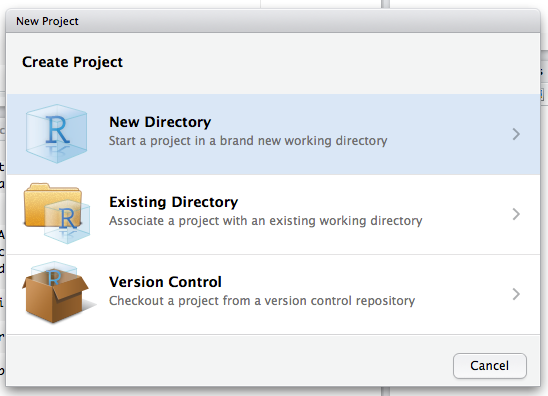{.small_window .knit_border .knit_image}

Select **New Directory**. If you already had your analyses and data ready, you
would choose "Existing Directory".

Now you should see this window:

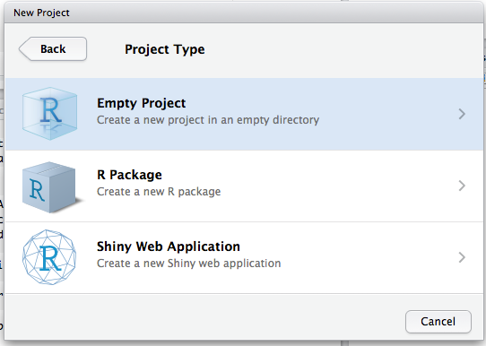{.small_window .knit_border .knit_image}

Select **Empty Project**. 

Now you see this window:

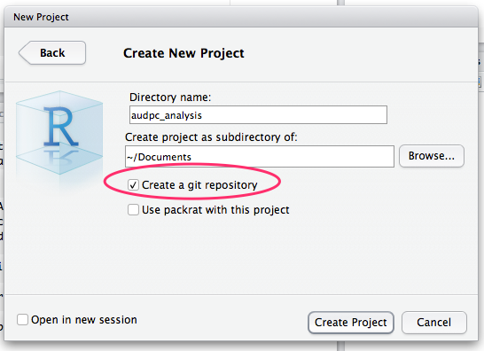{.small_window .knit_border .knit_image}

> If you are unable to check the box labeled Create git repository, make sure
that your RStudio is set up with git.

In the Directory Name box, type "audpc\_analysis". This will put the folder
"audpc\_analysis" inside of your Documents folder. The most important part is to
make sure that the **Create git repository** box is checked.

Hit the button labeled **Create Project**, the RStudio window will refresh and
you should see this:

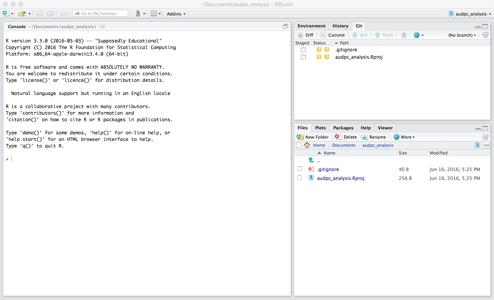{.big_window .knit_border .knit_image}

Now you have your first git repository! On the upper right hand side, you see
the git pane. In it you see that you have two files:

 - .gitignore 
 - audpc_analysis.Rproj

The file `.gitignore` tells git what it doesn't need to keep track of. By
default, these are things like your .Rhistory and .Rdata files. The file
audpc_analysis.Rproj is the file that tells RStudio that you are in an R project
and that it should start RStudio in that folder when you have that project open.

Notice, however that there are two yellow blocks with question marks inside of
them under a column labeled "Status". This is letting you know that there are
files there that git sees, but isn't keeping track of. To let git know that we
want to keep track of these files, we need to add them first with 
`r gloss("git add", add_def)`.

### git add: Telling git to keep track of files

Click the check boxes under the "Staged" column and the yellow boxes will change
to one green box that says "A" inside:

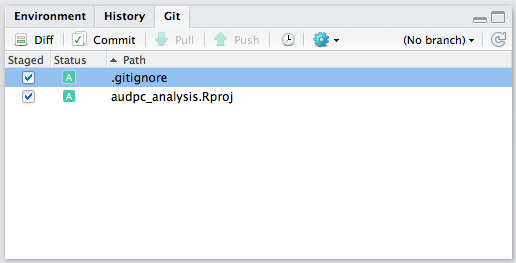{.small_window .knit_border .knit_image}

This means that you are telling git that you want to add these files to your 
repository. It's important to know that, while you have told git you want to add
them, it wants to know that you are serious about adding these files, so it 
wants you to **commit** to adding these files with 
`r gloss("git commit", commit_def)`.

### git commit: Saving this point in time

You can commit to adding these files by clicking on the **Commit** button in
that pane. When you do, this window will pop up:

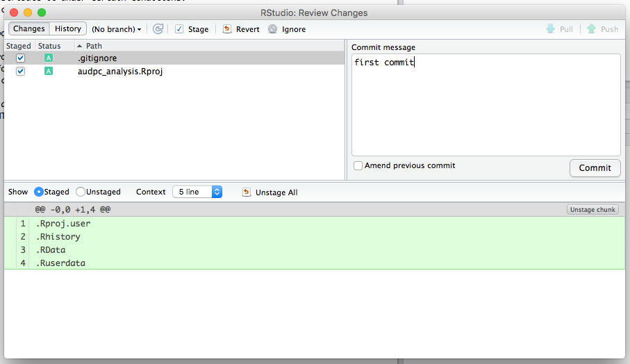{.med_window .knit_border .knit_image}

Here, you can see what files you will be committing and also the specific parts 
of the file that have changed. Green lines are those that have been added and
red for those that were deleted. We don't see any red here because nothing has
been deleted.

In the upper right, you have a message box. For each commit, you should write a
message as to why you are making that commit. This allows you to look back
through your history and understand why you made the changes you did. Write a
message in the box and then click on the button that says **Commit**. You should
see the following message:

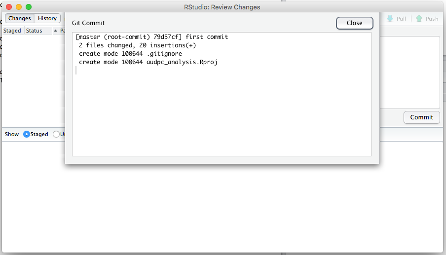{.med_window .knit_border .knit_image}

> Pro Tip! Commit messages should be like email subject lines: short and to the
point. If you want to write more, add a blank line after your message and then
write as much as you want (see below).

Now you have your git repository set up with the basic things needed to work
with git and RStudio. The next step is to set up your analysis.

## Step 2: adding a new Rmd file and making changes

1. Create a new Rmarkdown file by using the menu item **File > New File > R Markdown**
2. Give it a title like "AUDPC Analysis"
3. Save it in your folder as "AUDPC.Rmd"
4. Delete the demo script
5. Add a section and code chunk loading 'acricolae', 'dplyr', and 'ggplot2'
6. Add a section for the session information.
7. Save the file.
 
Your new file should look like this:

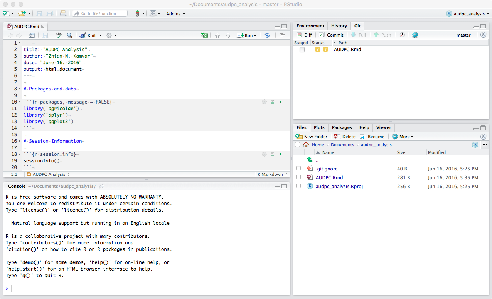{.big_window .knit_border .knit_image}

Now you should **add** and **commit** that file just like you did for the others
before, but add a different commit message: "add AUDPC Rmd file".

When you've done that, add some text explaining what the chunks are doing and
why you are using the specific packages like so:

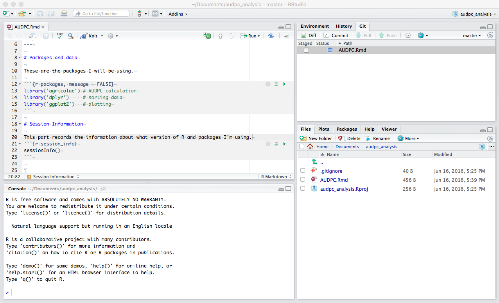{.big_window .knit_border .knit_image}

Notice that, in the above image, the indicator for the file in the git pane is 
now a blue box with an "M" in the middle. This means that you have modified a 
file that git is tracking. **Add** that file by clicking on the check box, hit
the **Commit** button, and then add a commit message saying what you did. Here's
an example:

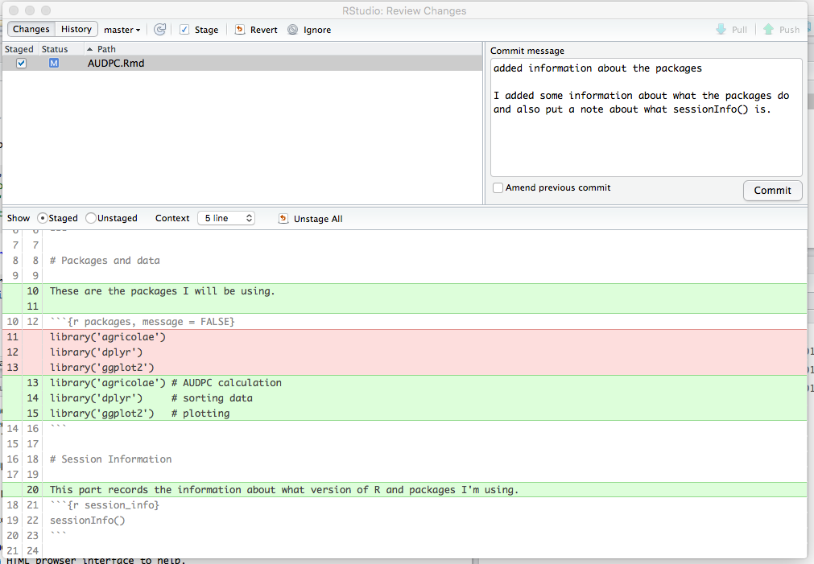{.med_window .knit_border .knit_image}

Now hit the **Commit** button and then click on the button at the top that says
**History**. You should see the following:

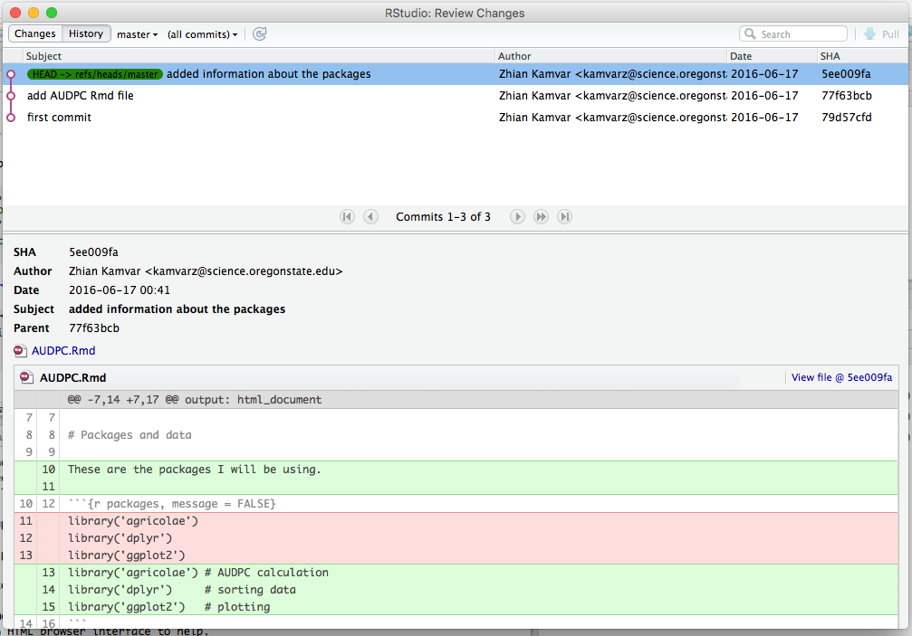{.med_window .knit_border .knit_image}

This is a history of all the commits that you have made in this repository for
the analysis. You can see when you made changes to the file and reasoning behind
why you made these changes.

## Conclusions

This was not meant to be a comprehensive tutorial on everything related to git,
but it should be enough to get you started. We hope that, after reading this
tutorial, you have the resources you need to keep track of your analyses using
git and explore reproducible research.

The next step is to utilize GitHub so that you can collaborate and store your
git repositories remotely.

# GitHub

GitHub is an online service that allows you to keep your projects on the web and
collaborate with others. In more technical terms, it serves as a 
`r gloss("remote repository", remote_def)` for your projects. In terms of storing
things remotely, this is similar to Dropbox or Google Drive, but that's where
the similarities end. With GitHub, like git, you are in control of all the
changes that are made. This section will take you through the process of setting
up an account with GitHub and it will teach you a few new terms such as 
`r gloss("clone", clone_def)`, `r gloss("push", push_def)`, 
`r gloss("pull", pull_def)`, and `r gloss("fork", fork_def)`.

## Step 1: Sign up for a GitHub account

If you haven't already done so, you should sign up for a GitHub account. Note
that you do not need to have git installed on your computer to do this. You can
sign up for a GitHub account by clicking on this link: https://github.com

## Step 2: Fork a repo

We've already presented two examples of handling reproducible research in R. 
Both of these are on GitHub:

 - AUDPC of *Puccinia striiformis*: https://github.com/grunwaldlab/audpc_example 
 - Index of Association of *Phytophthora infestans*:
   https://github.com/grunwaldlab/pinfestans_example

These repositories live in the grunwaldlab account on GitHub, but you can have a
copy for yourself. To do this, you create a `r gloss("fork", fork_def)` of the
repository into your own account. You can do this by using the **fork** button
in the top right corner of the webpage:

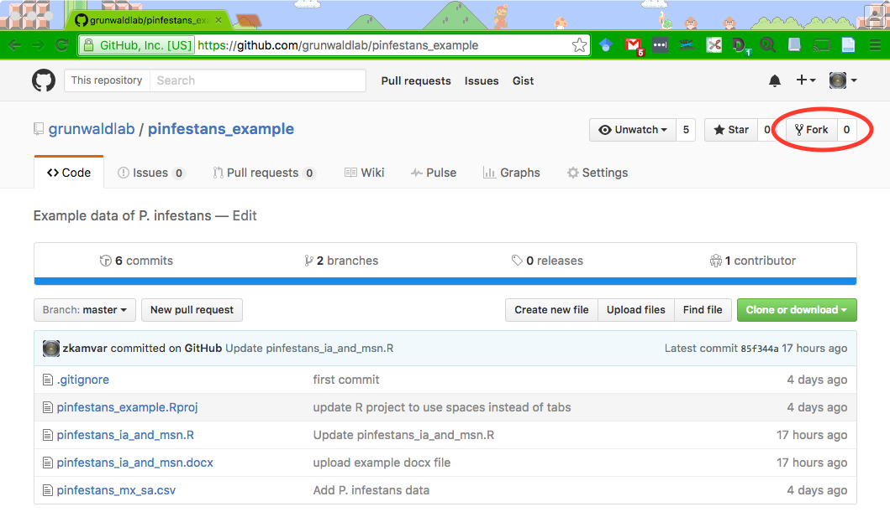{.big_window .knit_border .knit_image}

After you click this button, GitHub will copy that repository to your account
and take you there:

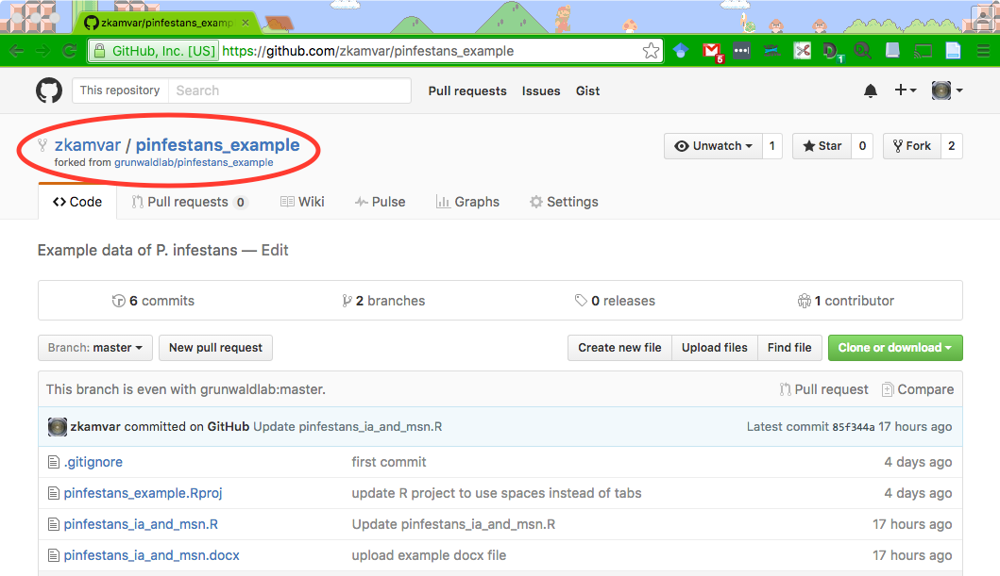{.big_window .knit_border .knit_image}

Notice that the username has changed and it says "forked from
grunwaldlab/pinfestans_example".

### Try it!

Fork both of these repositories to your own account! If you have written your
README.md from the Markdown exercise, upload it to the AUDPC repository and
commit that change.

## Step 3: Clone your fork

> This step requires that you have successfully installed git, signed up for a
GitHub account, and have installed a git client such as [Git
Kraken](https://www.gitkraken.com/),
[Sourcetree](https://www.atlassian.com/software/sourcetree), or [GitHub 
Desktop](https://desktop.github.com/)

A clone is an exact copy of a git repository. This will contain all of the files
within the repository as well as the entire history.

In this step, you download the repository to your computer. You do this by
clicking on the green button to the right of your screen:

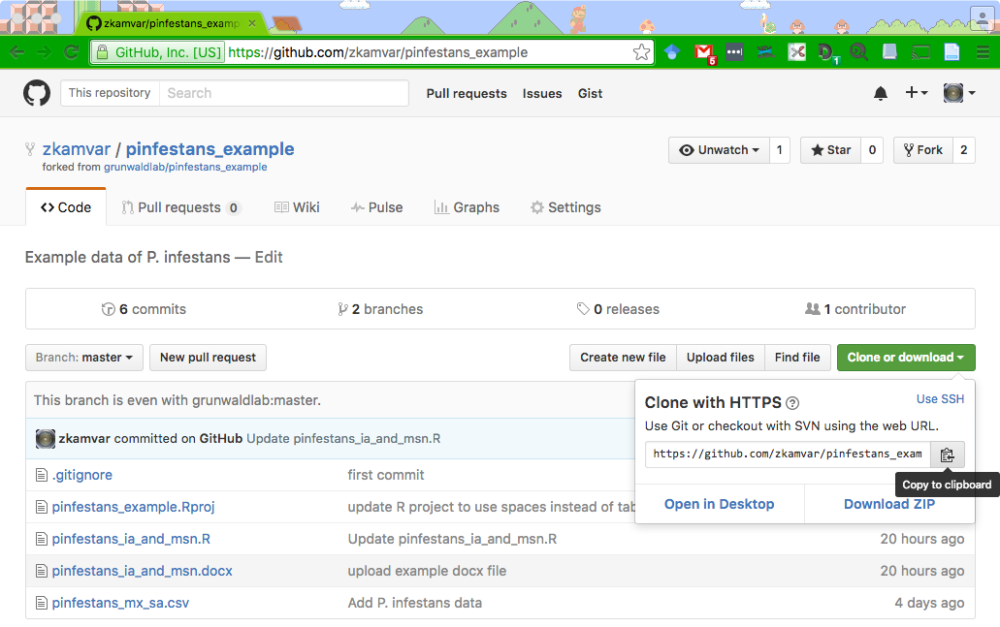{.big_window .knit_border .knit_image}

You can copy the URL and use your git client to download the repository to your
computer.

## Step 4: Pushing and Pulling

> This step requires that you have correctly set up either
[SSH](http://happygitwithr.com/ssh-keys.html) or
[HTTPS](http://happygitwithr.com/credential-caching.html) configuration for your
repository. Follow the links above for more inforamtion.

To move your changes to and from GitHub, you need to either **push** the changes
you've made on your computer to GitHub or **pull** the changes from GitHub to 
your computer. Unlike Dropbox or Google Drive, this is not an automatic process.
While this may not sound desirable, it allows you to only send stuff to GitHub
that actually works and makes sense, preventing you from accidentally sending
borked up analyses to the cloud. 

# Try it! {#exercise}

---------------

In your newly cloned repository, change something in your README.md file (or add
one if it's not there!), and then add and commit it. Now your local copy is one
commit ahead of the remote. To update the remote, you should **push** your
changes to the remote. You can either use your git client or RStudio to do this
using the pull and push buttons in your "Git" pane:

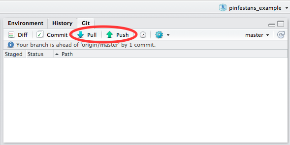{.knit_border .knit_image}

Go to your GitHub repository and see that the changes have successfully been 
made.

# Conclusions

We've given you a short introduction to using GitHub. Not only does using this 
technology allow your research to become more reproducible, but by sharing your
analyses, it also allows other researchers to learn how analyses are being done
in R, furthering reproducible research.

# Resources

## Interfaces

Git is primarily a program on the command line, but there are several graphical
user interfaces that are available for it:

- [GitHub Desktop](https://desktop.github.com/)
- [Sourcetree](https://www.atlassian.com/software/sourcetree)
- [Git Kraken](https://www.gitkraken.com/)

## Tutorials

There are often a plethora of tutorials at your fingertips with a simple Google 
search of "learn git". As this particular tutorial is only designed to introduce
you to git, we recommend browsing through these and seeing which ones work well
for you.

Here are a few that we've found to be helpful:

- [Try Git (from GitHub)](https://try.github.io/)
- [Happy Git and GitHub for the useR](http://happygitwithr.com/)
- [UBC's STAT 545 page on Git, GitHub, and RStudio](http://stat545.com/git00_index.html) (This has been field tested with students with varying degrees of computer literacy)
- [Hadely Wickham's take on git](http://r-pkgs.had.co.nz/git.html)

# Glossary

```{r glossary, results = 'asis', echo = FALSE}
gloss(display = TRUE)
```

