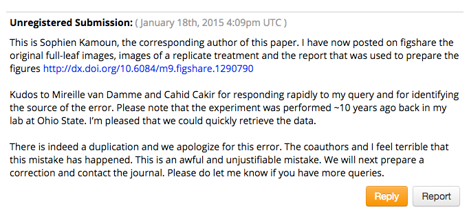
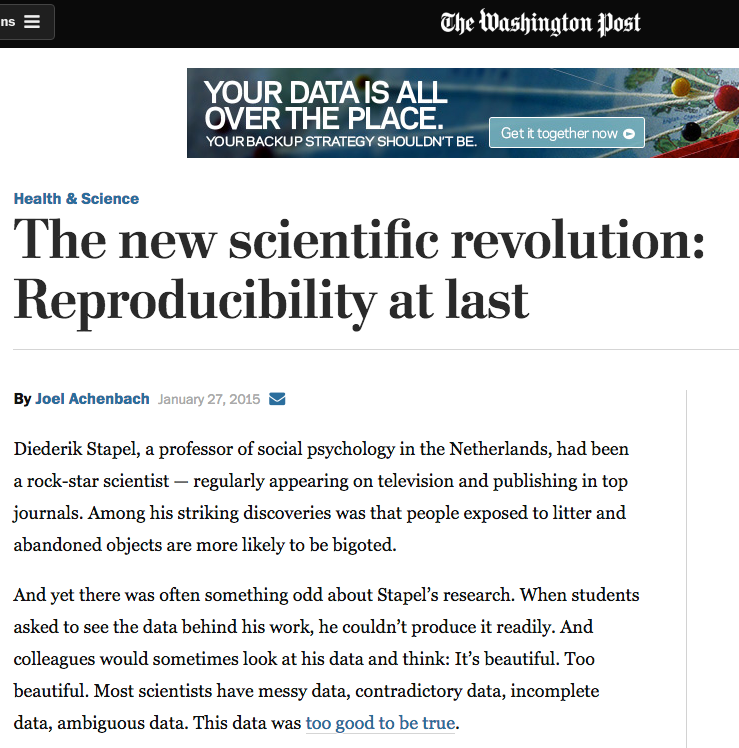
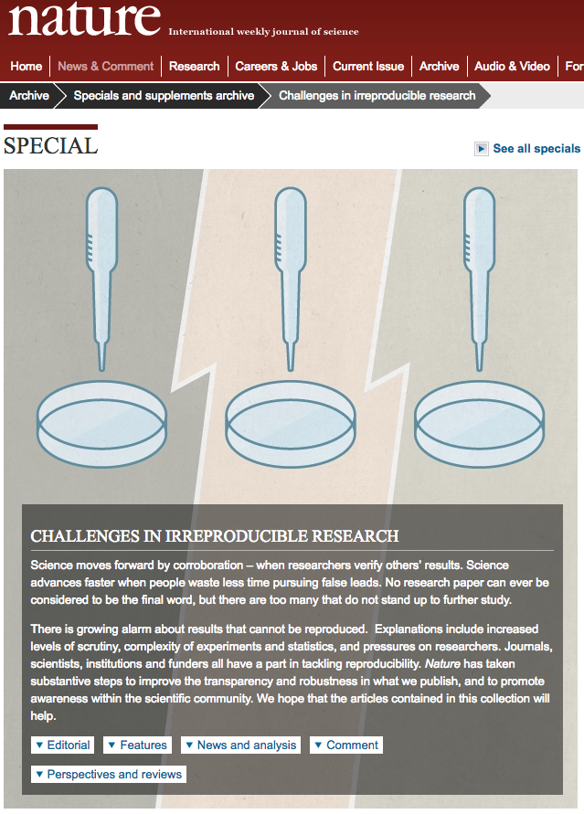
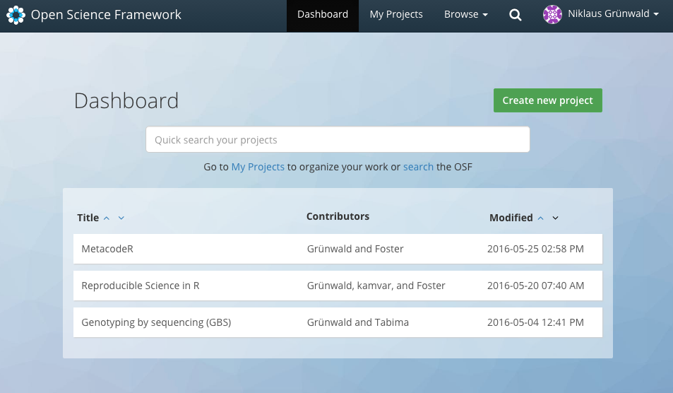
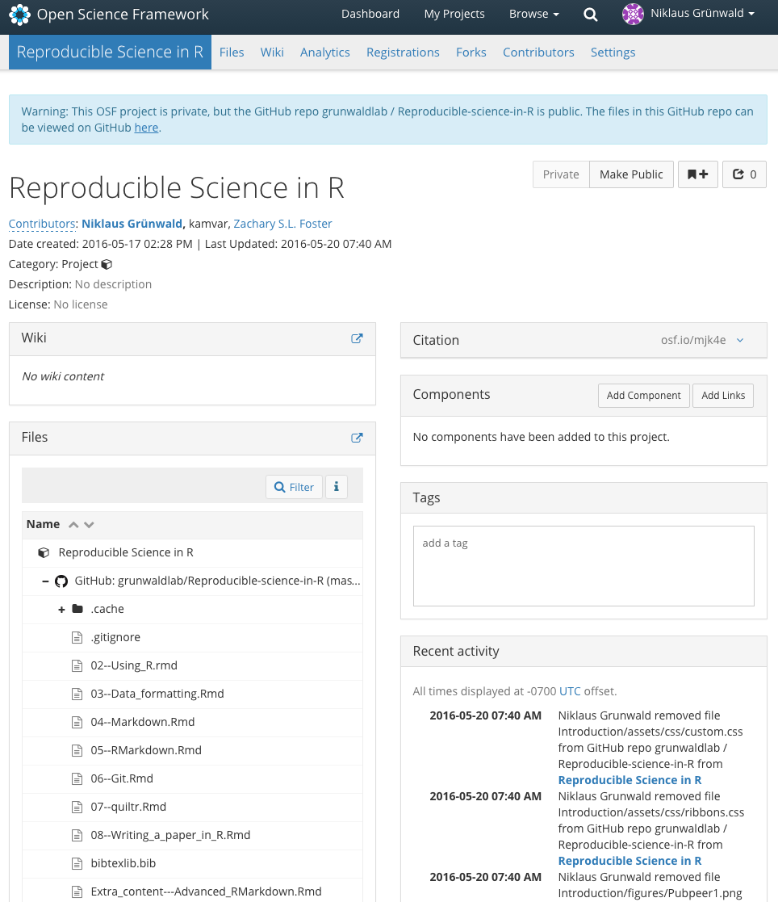

## A real-world example from PubPeer

<div style='text-align: center;'>
    
</div>

---

## A real-world example from PubPeer


---

## A real-world example from PubPeer



---

## Why is it important? 

<div style='text-align: center;'>
    
</div>

--- &twocol

## Challenges in irreproducible research

*** =left

<div style='text-align: center;'>
    
</div>

*** =right

<p></p>
<p></p>

"There is growing alarm about results that cannot be reproduced.  Explanations include increased levels of scrutiny, complexity of experiments and statistics, and pressures on researchers. Journals, scientists, institutions and funders all have a part in tackling reproducibility. Nature has taken substantive steps to improve the transparency and robustness in what we publish, and to promote awareness within the scientific community. We hope that the articles contained in this collection will help." [Nature](http://www.nature.com/news/reproducibility-1.17552)

---

## Where do you want to publish your work? 

<div style='text-align: center;'>
    
</div>

---

## Why should I practice it?

- Reproducibility is a core scientific principle
- Mandate from funding agencies towards open access, open data, etc.
- You don't want to end up in a headline
- Ability to respond to queries (e.g., PubPeer, colleagues, etc.)
- Ability to quickly find and correct errors
- Ability to build on past research
- Ability to share
- Ability to find what you need anytime, anywhere, fast

--- .quote .nobackground .segue

<q> ... reproducible research refers to the idea that the ultimate product of academic research is the paper along with the full computational environment such as code, data, ... that allow reproduction of results</q> 

<p></p>
Modified from [Wikipedia](https://en.wikipedia.org/wiki/Reproducibility#Reproducible_research)

--- .class #id 

## Fundamental to reproducible science ...


is the concept that the project is independent of the people who made it.

--- .class #id 

## What is reproducible science?

10 rules for computational science from Sandve et al. (2013):

1. For every result, keep track of how it was produced
2. Avoid manual data manipulation steps
3. Archive the exact versions of all external programs used
4. Version control all custom scripts
5. Record all intermediate results, when possible in standardized formats
6. For analyses that include randomness, note underlying random seeds
7. Always store raw data behind plots
8. Generate hierarchical analysis output, allowing layers of increasing detail to be inspected
9. Connect textual statements to underlying results
10. Provide public access to scripts, runs, and results

---

## [PLoS](http://journals.plos.org/plosone/s/data-availability) data policy:

Data availability allows and facilitates:

- Validation, replication, reanalysis, new analysis, reinterpretation or inclusion into meta-analyses
- Reproducibility of research
- Efforts to ensure data are archived, increasing the value of the investment made in funding scientific research
- Reduction of the burden on authors in unearthing old data, retaining old hard drives and answering email requests
- Easier citation of data as well as research articles, enhancing visibility and ensuring recognition for authors

---

## How do I practice reproducible science?

1. Open access to raw and  intermediately processed data in repositories. See [Nature](http://www.nature.com/sdata/policies/repositories)'s and [PLoS](http://journals.plos.org/plosone/s/data-availability)' suggested repositories, respectively.
2. Open access to programs, code, algorithms, etc. used.
3. Archive all assets related to a project (e.g., [OSF](https://osf.io/), [github](https://github.com/)), particularly images, code and data.
4. Open access papers (CC-BY or CC-BY-NC-ND licenses most common).
5. Pre-print servers like [bioRxiv](http://biorxiv.org/) and [PeerJ
preprints](https://peerj.com/about/preprints/what-is-a-preprint/).
6. Corresponding author willing to respond to any queries.
7. "Anything that can be automated, should be automated. Do as little as possible by hand." [H Wickham](http://r-pkgs.had.co.nz/intro.html)

---

## Open Science Framework (OSF)

We encourage you to use OSF:

<div style='text-align: center;'>
    
</div>

---

## Open Science Framework (OSF)

This workshop is at OSF:

<div style='text-align: center;'>
    
</div>

---

## R markdown

[R Markdown](http://rmarkdown.rstudio.com/) is an authoring format that enables easy creation of dynamic documents, presentations, and reports from R. It combines the core syntax of markdown (an easy to write plain text format) with embedded R code chunks that are run so their output can be included in the final document.


---

## Steps in making documents in R

Iterative:
- Author in `R markdown`
- Include what you would write in your lab notebook
- But, also includes text, data, code, figures, files, and other features
- To archive, print to html, pdf, slides, etc.
- Use version control (git) with backups (github) 
- If revision needed, just add and rerun reports

Final:
- When done, archive documents, R package versions and potentially software environment (docker)

--- &twocol

## R markdown language

*** =left

`*italics*` 

`**bold**` 

`# Header 1`

`## Header 2`


*** =right

<p><i>italics</i></p>
<b>bold</b>
# Header 1
## Header 2

--- &twocol

## Include R code as

*** =left
You can include R chunks as follows

    ```{r}`r ''`
        library("ggplot2")
        qplot(wt, mpg, data = mtcars)
    ```

*** =right
that will be rendered like this:

```{r simple-plot, fig.height = 5, fig.align = 'center', message = F}
 library("ggplot2")
 qplot(wt, mpg, data = mtcars)
```

---

## Limits to reproducibility


- large data or intermediate data
- file formats and code can become obsolete
- technology changes and evolves (e.g. 454 sequencing is obsolete)
- deposition of living material in culture collections or seed banks
- some scientists hate to share data, code, figures, etc.

---

## One future scenario

<div style='text-align: center;'>
    
</div>
<p></p>
<p>From Beaulieu-Jones et al. 2016</p>

---

## Acknowledgements

- Yihui Xie: [knitr](http://yihui.name/knitr/) to translate documents from R markdown into html and other formats
- [R markdown](http://rmarkdown.rstudio.com/)
- [Git/github](http://kbroman.org/github_tutorial/)
- []()
- Ramnath Vaidyanathan: [Slidify](http://slidify.org/), for making these very slides in R markdown

--- 

## References & Resources

- Sandve GK, Nekrutenko A, Taylor J, Hovig E (2013) Ten Simple Rules for Reproducible Computational Research. PLoS Comput Biol 9(10): e1003285. doi: [10.1371/journal.pcbi.1003285](10.1371/journal.pcbi.1003285)
- Reproducible research. 2016. [Wikipedia](https://en.wikipedia.org/wiki/Reproducibility#Reproducible_research)
- Challenges in irreproducible science. 2016. Special issue. [Nature](CHALLENGES IN IRREPRODUCIBLE RESEARCH)
- [RopenScience reading list](http://ropensci.github.io/reproducibility-guide/sections/references/)
- [rOpenSci](https://ropensci.org/), tools for open science using R.
- Brett K Beaulieu-Jones, Casey S Greene (2016) Reproducible Computational Workflows with Continuous Analysis. bioRxiv  [doi](http://dx.doi.org/10.1101/056473)

--- 

## Contact and Feedback

- Nik Grünwald:     grunwaln@oregonstate.edu |  [@PhytophthoraLab](https://twitter.com/PhytophthoraLab)
- Zhian Kamvar:     kamvarz@oregonstate.edu
- Zach Foster:      fosterz@oregonstate.edu 

<p>Please provide us feedback on how to improve the workshop and what other topics you would like to see covered in the future.</p>

<p></p>
- [Survey at http://goo.gl/forms/OCFxqPbXhsWMBQYT2](http://goo.gl/forms/OCFxqPbXhsWMBQYT2)
- [Course materials](http://grunwaldlab.github.io/Reproducible-science-in-R/)
- [Github documents](https://github.com/grunwaldlab/Reproducible-science-in-R)
